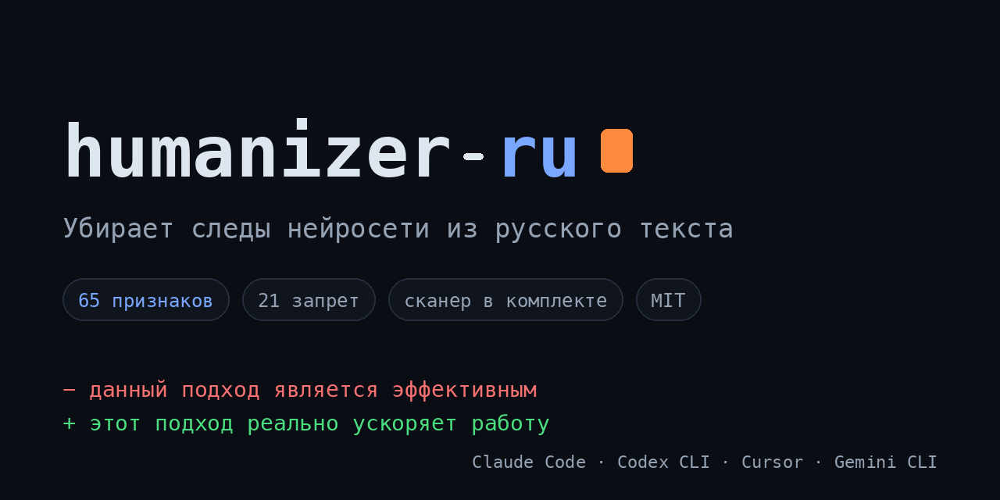

# humanizer-ru: очеловечить русский AI-текст для Claude Code, Cursor, Codex и других AI-агентов

> Скилл для Claude. Убирает 53 признака нейросети в русском тексте: канцелярит, кальки, фингерпринты ChatGPT и Claude. Метит в то, что меряют GPTZero, DivEye, RuBERT: поднимает perplexity и burstiness. 20 жёстких банов, quad-pass аудит, калибровка под голос автора, eval-харнес с метриками до/после.

> [English version](README.en.md)

[](LICENSE)
[](https://github.com/ilyautov/humanizer-ru/blob/main/CHANGELOG.md)
[](https://github.com/ilyautov/humanizer-ru/stargazers)
[](https://skills.sh/ilyautov/humanizer-ru/humanizer-ru)

<p align="center">
  <a href="https://humanizer-ru.aifrontier.tech/">
    
  </a>
</p>

> **Было:** «В современном мире данная технология является не просто инструментом, а стратегическим активом».
> **Стало:** «Инструмент экономит команде сорок минут в день. Попробуйте теперь его у людей забрать».
>
> Три жёстких бана в одном предложении. [Полный разбор с режимом аудита ниже](#до-и-после).

📖 **Документация и разборы:** [humanizer-ru.aifrontier.tech](https://humanizer-ru.aifrontier.tech/): [работают ли AI-детекторы на русском](https://humanizer-ru.aifrontier.tech/ai-detektory-na-russkom.html), [53 признака AI-текста](https://humanizer-ru.aifrontier.tech/52-priznaka-ai-teksta.html), [антиплагиат и нейросеть](https://humanizer-ru.aifrontier.tech/antiplagiat-i-neyroset.html).

## Зачем это нужно

Английский [humanizer](https://github.com/blader/humanizer) для русского текста не работает. У русских AI-маркеров своя физика: канцелярит («осуществление внедрения»), кальки с английского синтаксиса («стоит отметить, что»), отсутствующие частицы («же», «ведь», «вот»), которыми живой русский дышит. С английскими паттернами это не пересекается вообще.

Кроме того, в 2025-2026 Claude и GPT-4/5 научились имитировать «глубокомысленность»: короткими рублёными предложениями («Точно. Отдельно. Рефлексивно.»), псевдо-сократическими вопросами («Зачем? Потому что.») и псевдо-терапевтическим регистром («ты не ошибаешься, что так чувствуешь»). Это новый слой маркеров, которого нет ни в одном другом humanizer.

## Что внутри

**53 паттерна AI-генерации в 12 категориях:**

- A. Контентные: пустые открытия, размытые авторитеты, формульные выводы
- B. Языковые: канцелярит, кальки, «является», нагромождение причастий
- C. Стилистические: длинные тире, навязчивые списки, болд
- D. Коммуникативные: артефакты чатбота, заискивание, водянистость
- E. Морфологические: падежные ошибки, деепричастия не к подлежащему
- F. Тональные: эмоциональная стерильность (4 подтипа), нет иронии, нет метафор
- G. Структурные: разорванные абзацы, narrative drift, галлюцинации
- H. Человеческие мелочи: идеальная грамотность, вылизанная типографика
- I. Паттерны убеждения: негативные параллелизмы, авторитетные трюизмы
- J. Информационный ритм: равномерная плотность, гладкие переходы, macro-burstiness
- K. Хеджирование и специфика: модальная неопределённость, translationese, нет идиом
- L. Стилистические фингерпринты 2025-2026: рваная медитативность, контр-вопросы, эмодзи-декор, псевдо-терапия, пустой образ

**20 жёстких банов**: конструкции с абсолютным запретом. От «В современном мире...» и «Стоит отметить, что...» до маркетинговых клише «Раскрыть потенциал», «Комплексный подход», «Открывает новые горизонты».

**Quad-pass аудит**: четыре независимых прохода: Детектор (поиск маркеров), Человек с улицы (взгляд читателя), Кардиограмма (вариативность информационной плотности), Скелет (анализ первых строк пунктов списка на шаблонность).

**Калибровка под голос автора.** Если дать образцы своего письма, скилл анализирует ритм, лексику, любимые обороты, пунктуацию, тон и применяет ваш стиль вместо средне-нейтрального.

**Три режима работы:**
- Полное редактирование (по умолчанию): все 53 паттерна
- Аудит: только диагностика, текст не трогает
- Точечная правка: работа с одной категорией

**Что ловят детекторы:** секция с числами из исследований 2025-2026. DivEye: вторые производные surprisal дают 39.4% вклада в детекцию. Perplexity gap 29.5 vs 15.2 (человек vs LLM). AINL-Eval 2025: лучший результат на тесте около 86% (52K русских текстов, 12 доменов). Все ссылки и цифры верифицированы по первоисточникам, см. [SOURCES.md](SOURCES.md).

## Установка

Скилл разворачивается тремя путями: загрузкой в веб-интерфейс Claude.ai, централизованной раскаткой на команду или установкой в локальные агенты (Claude Code, Cowork, API).

### 1. Claude.ai (веб-интерфейс)

1. Скачайте репозиторий ZIP-архивом:
   `https://github.com/ilyautov/humanizer-ru/archive/refs/heads/main.zip`
2. Откройте Claude.ai → **Settings** → **Capabilities** → **Skills**.
3. Нажмите **Upload skill** и выберите скачанный архив.

> Если Claude.ai не принимает архив из-за вложенной папки `humanizer-ru-main`, склонируйте репозиторий и заархивируйте папку вручную:
>
> ```bash
> git clone https://github.com/ilyautov/humanizer-ru.git
> zip -r humanizer-ru.zip humanizer-ru/
> ```

### 2. Организации (Enterprise и Team)

Администраторы Claude for Work раскатывают скилл централизованно через workspace skill library, и он становится доступен всей команде без индивидуальной загрузки. Загрузите ZIP в **Admin Console → Workspace Skills → Add skill**.

### 3. Claude Code, Cowork и API (локальные агенты)

**Через плагин-маркетплейс** (рекомендуется):

```
/plugin marketplace add ilyautov/humanizer-ru
/plugin install humanizer-ru@ilyautov-plugins
```

После установки плагин подгружает скилл автоматически при триггерах вроде «очеловечь», «убери канцелярит», «перепиши как человек».

**Через skills.sh CLI** (универсальный путь для любого Claude-агента):

```bash
npx skills add ilyautov/humanizer-ru
```

CLI кладёт `SKILL.md` в `~/.claude/skills/humanizer-ru/` и регистрирует скилл в индексе [skills.sh](https://skills.sh/ilyautov/humanizer-ru/humanizer-ru).

**Через API (`/v1/messages` и аналоги):** передайте скилл параметром `container.skills`. Детали в документации вашего клиента.

**Вручную** (если ничего из выше не подошло):

```bash
git clone --depth 1 https://github.com/ilyautov/humanizer-ru /tmp/humanizer-ru
mkdir -p ~/.claude/skills
cp -r /tmp/humanizer-ru/skills/humanizer-ru ~/.claude/skills/
```

Копируйте папку целиком, а не один SKILL.md: вместе со скиллом едет
детерминированный сканер `scripts/scan.py` (машинная половина режима «Аудит»;
работает при наличии `pip install razdel pymorphy3`, без них скилл просто
проводит аудит вручную).

### 4. Codex CLI (OpenAI)

Codex использует тот же формат Agent Skills, отдельная версия не нужна:

```bash
git clone --depth 1 https://github.com/ilyautov/humanizer-ru
mkdir -p ~/.codex/skills
cp -r humanizer-ru/skills/humanizer-ru ~/.codex/skills/
```

Либо изнутри Codex через `skill-installer`: укажите путь
`ilyautov/humanizer-ru/skills/humanizer-ru`. После установки перезапустите Codex;
вызов: `$humanizer-ru` или автоматически по триггер-фразам («очеловечь»,
«убери канцелярит»). Проектная установка: та же папка в `.codex/skills/` внутри репозитория.

Или клонированием:

```bash
git clone https://github.com/ilyautov/humanizer-ru.git ~/.claude/skills/humanizer-ru
```

### 5. Другие агенты (общий стандарт SKILL.md)

Формат Agent Skills стал кросс-платформенным, поэтому humanizer-ru работает и за пределами четырёх упакованных стеков выше. Официально упакованы и проверены: Claude Code, Codex CLI, Cursor, Gemini CLI. Остальные агенты читают тот же `SKILL.md`, отдельная версия не нужна.

| Как подключается | Агенты | Что делать |
|---|---|---|
| Читают `SKILL.md` нативно | GitHub Copilot, Cline, Roo Code, Kilo Code, Goose, OpenCode, OpenWork, Kimi Code CLI, OpenClaw, OpenHuman, Hermes | Скопировать папку `skills/humanizer-ru` в каталог скиллов агента (например `~/.hermes/skills/`, `~/.kimi/skills/`, `.agents/skills/`) |
| Конвертация инсталлером | Windsurf, Trae, Junie | Поставить через их установщик скиллов, указав репозиторий `ilyautov/humanizer-ru` |
| Ручная вставка | Zed, Aider, Continue.dev | Вставить тело `SKILL.md` в файл правил или инструкций агента |

Универсальный путь для нативных: положите папку скилла в каталог, который агент сканирует (обычно `<корень проекта>/.agents/skills/` или `~/.config/agents/skills/`), и перезапустите агент. Триггеры активации те же, что в Claude.

> У части этих агентов (OpenClaw, Kimi, Hermes) есть публичные каналы дистрибуции скиллов (реестр ClawHub, tap-репозитории). Листинг там даёт охват без отдельного кода: формат общий.

## Использование

Попросите Claude по-русски:

```
Очеловечь этот текст: [вставьте текст]
Перепиши, звучит как робот: [вставьте текст]
```

Триггеры срабатывания: «очеловечь», «убери следы нейросети», «сделай живым», «звучит искусственно», «перепиши как человек», «убери канцелярит», «слишком формально».

Режим аудита (только диагностика, без переписывания):

```
Проверь этот текст на AI-маркеры: [вставьте текст]
```

Точечная правка одной категории:

```
Убери канцелярит из текста: [вставьте текст]
```

При установке плагином в Claude Code доступны slash-команды:

```
/humanize <текст или путь к файлу>   # полный рерайт
/audit <текст или путь к файлу>      # аудит без правки (сканер + разбор)
```

## До и после

**Полное редактирование:**

До:
> В современном мире искусственный интеллект играет всё более важную роль в различных сферах деятельности. Стоит отметить, что данная технология является мощным инструментом для оптимизации рабочих процессов.

После:
> За последний год я внедрил AI-инструменты в три проекта. Два ускорились вдвое. Третий развалился, потому что команда перестала проверять то, что выдаёт модель. AI работает, когда понимаешь его ограничения.

Пять жёстких банов сработали в двух предложениях. Типичная картина.

**Режим аудита на том же тексте выдаст:**

```
[A] Пустое открытие: "В современном мире..."
[A] HARD BAN: "является мощным инструментом"
[A] HARD BAN: "играет важную роль"
[A] HARD BAN: "Стоит отметить, что..."
[B] Канцелярит: "оптимизации рабочих процессов"
[B] Раздувание: "всё более важную роль в различных сферах"
```

## Работают ли AI-детекторы на русском языке?

Коротко: плохо, и это важно понимать.

GPTZero, Originality.ai, ZeroGPT и другие популярные детекторы AI-текста обучены в основном на английском. На русском они ненадёжны и ошибаются в обе стороны:

- **Ложные срабатывания (false positives):** текст, написанный живым человеком, регулярно помечается как «сгенерировано нейросетью». Английские пороги perplexity для русского не откалиброваны, а богатая русская морфология сама задирает «непредсказуемость».
- **Пропуски (false negatives):** аккуратный AI-текст проходит как человеческий.

Даже лучший специализированный русский детектор (RuRoBERTa на бенчмарке AINL-Eval 2025) даёт около 86% точности: каждый седьмой вердикт мимо. И детекторы не обобщаются между доменами: обученный на научных текстах ошибается на блогах (verified, см. [SOURCES.md](SOURCES.md)).

**Что это значит для очеловечивания текста.** Гнаться за «обходом детектора» на русском значит подгонять текст под ненадёжный и постоянно меняющийся индикатор. Поэтому humanizer-ru оптимизирует не обман детектора, а **реальное качество текста**: убирает канцелярит, кальки и штампы, возвращает авторский голос и живой ритм. Это измеримые свойства языка (метрики в [`eval/`](eval/)), которые не зависят от того, насколько плох конкретный детектор. Заодно растут perplexity и burstiness: то, что детекторы (как умеют) и пытаются мерить.

Мы прогоняем детекторы прямо в eval-харнесе по контролю «заведомо человек» (дословные отрывки статей Википедии, написанные людьми задолго до ChatGPT). В последнем прогоне локальный LLM-детектор пометил как ИИ **3 из 3** человеческих текстов (false positive rate 100%), поставив им ту же вероятность «это AI», что и настоящим AI-текстам. Различающая способность близка к нулю. Методика, корпус и сырые прогоны: [eval/RESULTS.md](eval/RESULTS.md), секция «FP-аудит детекторов».

## Часто ищут

**Как обойти GPTZero на русском?** GPTZero измеряет perplexity и burstiness. Скилл поднимает оба показателя: контрастное вычитание (замена самого предсказуемого слова в каждом предложении) повышает perplexity, рваный ритм с короткими и длинными предложениями повышает burstiness. Адверсарный парафраз снижает true positive rate детекторов на 87.88% по NeurIPS 2025.

**Как убрать признаки ChatGPT из текста?** Главные сигналы: «не просто X, а Y» (80%+ AI-текстов), «стоит отметить», «является», длинное тире, отсутствие частиц «же/ведь/вот», равномерная информационная плотность. Скилл ловит и заменяет все 53 паттерна.

**Как сделать текст ChatGPT человеческим на русском?** Три шага: убрать 20 жёстких банов, пройти контрастным вычитанием (одна замена на предложение), добавить речевые привычки (частицы, иронию, личное мнение, метафоры). Калибровка под голос автора усиливает эффект.

**Что такое канцелярит и как его убрать?** Канцелярит: превращение глаголов в отглагольные существительные («осуществление внедрения» вместо «внедрили»). Главный маркер русских AI-текстов. Соотношение существительных к глаголам у AI 3:1, у людей 2:1. Скилл разворачивает номинализации обратно в глаголы.

**Работает ли GPTZero на русском языке?** Ненадёжно. GPTZero обучен на английском и на русском даёт много ложных срабатываний: помечает живые человеческие тексты как ИИ, а аккуратный AI-текст пропускает. Подробнее в разделе «Работают ли AI-детекторы на русском».

**Почему мой текст помечают как ИИ, хотя я писал его сам?** Частая беда на русском: детекторы, обученные на английском, принимают за «машинность» нормальные свойства русского текста (морфология, длинные слова, формальный регистр). Если текст реально ваш, это ложное срабатывание детектора, а не приговор. Скилл помогает убрать конкретные машинные маркеры (канцелярит, кальки, штампы), от которых текст звучит «нейросетево».

**Какой AI-детектор лучший для русского?** Идеального нет. Из специализированных лучше показывают себя fine-tuned модели на базе RuRoBERTa (бенчмарк AINL-Eval 2025, ~86%), но и они проседают между доменами. Универсальные англоязычные (GPTZero, Originality, ZeroGPT) на русском особенно ненадёжны. Практический вывод: ориентируйтесь на реальное качество текста, а не на вердикт одного детектора.

**Работает ли это с Claude Sonnet / Opus 4?** Да. Это инструкция-каталог для любой модели Claude. Чем больше контекст модели, тем глубже она применяет правила. На Opus результат заметно сильнее на длинных текстах.

**Можно ли использовать без плагина?** Да. Скачайте SKILL.md и используйте как чек-лист для ручной правки или вставляйте в системный промпт любой LLM (ChatGPT, Gemini, YandexGPT, GigaChat).

**А если мне нужно длинное тире (я редактор / формальная типографика)?** По умолчанию скилл вычищает все длинные тире «—»: это главный типографический маркер AI, и живой неформальный русский его почти не ставит (с телефона печатают дефис). Но если вам нужна правильная издательская типографика, прямо скажите об этом: «я профессиональный редактор, длинное тире оставляй». Скилл снимет запрет. Сам он это исключение не включает. Решаете вы.

## Чем отличается от английского humanizer

| | humanizer-ru | blader/humanizer |
|---|---|---|
| Язык | Русский | Английский |
| Паттернов | 53 | 32 |
| Жёстких банов | 20 | - |
| Аудит | Quad-pass | Single-pass |
| Voice calibration | Да | Да |
| Стилистические фингерпринты 2025-2026 | Да | Нет |
| Морфология RuBERT-детекторов | Да | - |
| Macro-burstiness структурных блоков | Да | Нет |

Английский humanizer ловит универсальные AI-маркеры. Русские требуют отдельной модели: канцелярит, кальки с английского синтаксиса, частицы «же/ведь/вот», падежные согласования RuBERT-детекторов, морфологические ошибки длинных цепочек, плюс свежие фингерпринты Claude и GPT 2025-2026 («рваная медитативность», эмодзи-декор, псевдо-терапия), которые в англоязычных каталогах ещё не оформлены.

## Источники

Скилл собран из четырёх независимых источников развития:

- **Wikipedia: WikiProject AI Cleanup**: базовый каталог признаков AI-текста на русском
- **15+ русскоязычных публикаций**: Habr, vc.ru, Gramota.ru, стилометрические исследования ВШЭ, Dialog Conference (RuATD-2022 и AINL-Eval 2025), TechInsider, Kokoc.com
- **Верифицированные публикации (2024-2026)**: DivEye, PIFE, MASH, Antislop, AINL-Eval, RuATD, NeurIPS 2025 и др. Каждая ссылка и цифра проверена по arxiv и первоисточникам; неподтверждённые удалены. Полная таблица провенанса: [SOURCES.md](SOURCES.md).

Changelog: [CHANGELOG.md](CHANGELOG.md). Метрики и eval-харнес: каталоги [`scripts/`](scripts/) и [`eval/`](eval/).

## Автор

Илья Утов. Пишу про AI и работу с текстом в Telegram: [Under the Hood](https://t.me/gorilla_under_hood).

## Лицензия

MIT: используйте свободно, форкайте, дорабатывайте. Pull request с новыми паттернами приветствуются.

---

**humanizer-ru** помогает очеловечить русский AI-текст: убрать следы нейросети, канцелярит и штампы, вернуть живой голос и сделать текст человечным. Это бесплатный open-source скилл для Claude (Claude Code, Cowork, API), а не онлайн-сервис «в один клик». Почему детекторы AI и проверка текста на нейросеть на русском ненадёжны (и при чём тут антиплагиат): в разделах выше, с реальными данными из нашего eval-харнеса, а не из обещаний.
